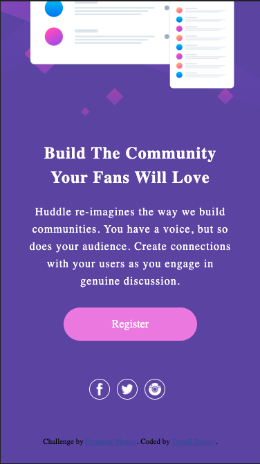
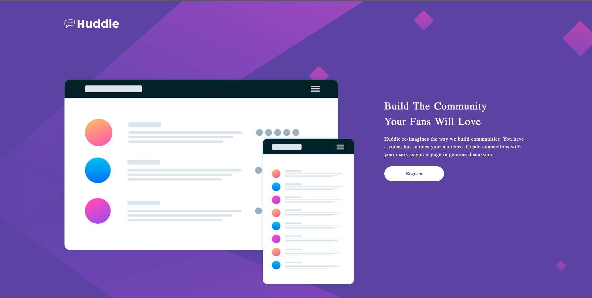

# Frontend Mentor - Huddle landing page with single introductory section solution

## Table of contents

- [Overview](#overview)
  - [The challenge](#the-challenge)
  - [Screenshot](#screenshot)
- [My process](#my-process)
  - [Built with](#built-with)
  - [What I learned](#what-i-learned)
  - [Useful resources](#useful-resources)
- [Author](#author)

## Overview

### The challenge

Users should be able to:

- View the optimal layout for the page depending on their device's screen size
- See hover states for all interactive elements on the page

### Screenshot

Mobile -> 
Active -> 
Desktop -> 

## My process

Start with mobile view, then moved on to styling. Once all of that was completed, moved on to the desktop view. 

### Built with

- Semantic HTML5 markup
- CSS custom properties
- Flexbox
- CSS Grid
- Mobile-first workflow

### What I learned

I really wanted to focus on using proper html on this one, and not just styling everything in divs. Using Header tags, section tags and footer tags. 

### Useful resources

Find the social media icons -> https://www.iconsdb.com/white-icons/white-social-icons.html

## Author

- Website - [Terrell Tinsley](https://www.your-site.com)
- Frontend Mentor - [@TRellTins](https://www.frontendmentor.io/profile/trelltins)
- Twitter - [@TRellTinsley](https://www.twitter.com/trelltinsley)
